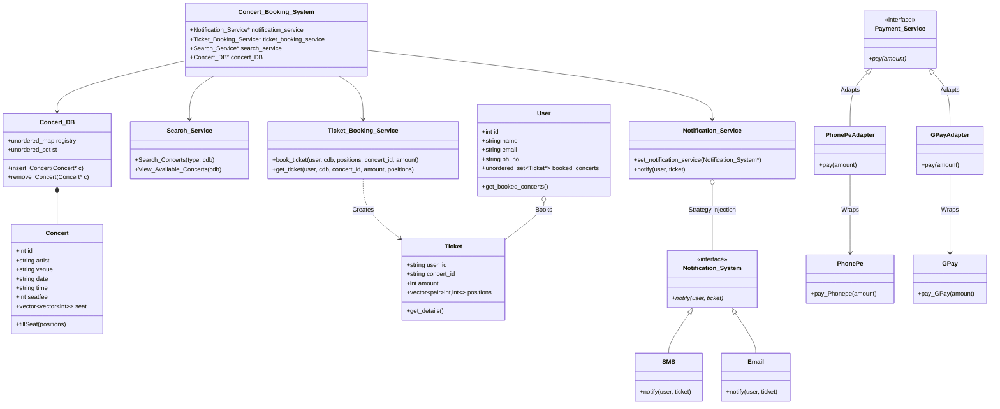

# Concert Booking System (Low-Level Design)

A comprehensive Low-Level Design (LLD) implementation of a Concert Booking System in C++. This project demonstrates object-oriented design principles and various design patterns to manage concerts, user bookings, payments, and notifications.

## Features
- **Concert Management**: Add and maintain concert events, venues, seats, and timings in an in-memory database.
- **Search System**: Search and list available concerts filtered by artist, date, venue, or time.
- **Ticket Booking System**: Reserve exact matrix locations (row/col) for a concert and generate a dynamic ticket.
- **Payment Processing**: Simulated integrated payment gateway utilizing the **Adapter Pattern** with interfaces handling multiple payment APIs (`PhonePe`, `GPay`).
- **Notification Interface**: Dynamic notification triggers utilizing the **Strategy Pattern** with interchangeable modes of communication (`Email`, `SMS`).

## Core Architecture and Design Patterns

1. **Facade Pattern (Conceptual)**: `Concert_Booking_System` acts as the unified initializer and gateway context to orchestrate all the complex subsystems without tightly coupling the main function.
2. **Strategy Pattern**: The `Notification_Service` accepts any dynamic class fulfilling the `Notification_System` interface. Notification modes like `SMS` or `Email` can be injected interchangeably at runtime.
3. **Adapter Pattern**: The system processes payments using a standard `Payment_Service` interface. Since 3rd-party services (`PhonePe` and `GPay`) have different implementations, `PhonePeAdapter` and `GPayAdapter` adapt these concrete foreign classes into the standard interface.

## LLD Class Diagram

Below is the modular class dependency and architecture chart representing the Concert Booking System:



## How to Build & Run
Ensure you have a C++17 compatible compiler installed (like `g++`).

Run the following command to compile the system:
```bash
g++ -std=c++17 Concert_Booking_System.cpp -o main.exe
```

Run the compiled executable:
```bash
./main.exe
```

## File Structure breakdown
- `Concert_Booking_System.cpp`: Main subsystem context and execution gateway.
- `Concert_DB.cpp`: In-memory data structures holding active concert availability. 
- `Search_Service.cpp`: Performs availability scans and formatting.
- `Ticket_Booking_Service.cpp`: Manages concurrency constraints and validates user matrix seat selections.
- `Payment_Service.cpp`: Adapter implementations for third-party mock payment gateways.
- `Notification_Service.cpp`: Communication dispatch implementations (SMS, Email integrations).
- `User.cpp` / `Ticket.cpp` / `Concert.cpp`: Core application logic objects/models.
"# Concert_Booking_System_Low_Level_Design" 
